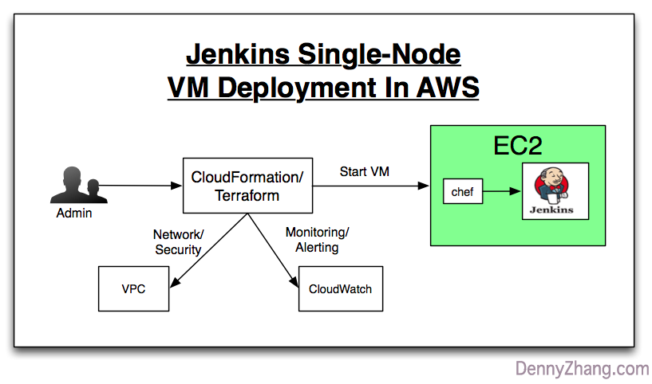
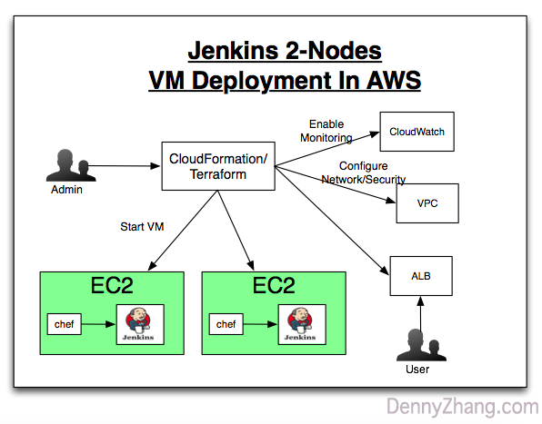
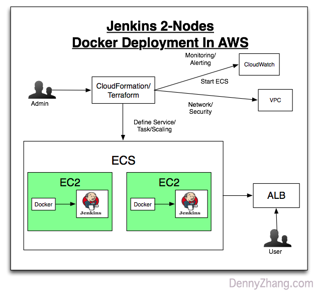

# aws-jenkins-study

 

  

File me [tickets](https://github.com/DennyZhang/aws-jenkins-study/issues) or star [the repo](https://github.com/DennyZhang/aws-jenkins-study).

Table of Contents
=================

   * [aws-jenkins-study](#aws-jenkins-study)
   * [Requirements](#requirements)
      * [Scenario: VM Single-Node Deployment](#scenario-vm-single-node-deployment)
      * [Scenario: VM 2-Nodes Deployment](#scenario-vm-2-nodes-deployment)
      * [Scenario: ECS Single-Node Deployment](#scenario-ecs-single-node-deployment)
      * [Scenario: ECS 2-Nodes Deployment](#scenario-ecs-2-nodes-deployment)
   * [Highlights](#highlights)
   * [Follow Up](#follow-up)
   * [More Resources](#more-resources)
   * [License](#license)

Case study using AWS techstack to setup Jenkins env

# Requirements
Setup Jenkins in AWS using cloud formation and your favorite config mgmt tool(Chef/Puppet)
- Use cloud formation start EC2 VM
- Use Chef to deploy Jenkins instance
- Jenkins install sample jobs
- [Optional] Setup ELB/ASG
- [Optional] Security Hardening
- [Optional] Monitoring/Alerting

## Scenario101: VM Single-Node Jenkins Deployment
- Objective: We need a live Jenkins env in Cloud. Fast and easy.
- Main Tech: Use Cloudformation to start an EC2 instance. Then provision Jenkins via Chef

## Scenario102: VM Single-Node Jenkins Deployment II
- Objective: Try to customize Jenkins by adding an extra Jenkins user.
- Main Tech: Cloudformation, Chef

## Scenario103: VM Single-Node Jenkins Deployment III
- Objective: Besides Scenario102, get slack notification when Jenkins server is down.
- Main Tech: Cloudformation, Chef, Jenkins plugin, Slack

## Scenario104: Docker Single-Node Deployment
- Objective: Immutable infra would be faster and reliable, compared to conf mgmt tool.
- Main Tech: Cloudformation, Docker

## Scenario105: ECS Single-Node Deployment
- Objective: Get exposed to docker orchestration service.
- Main Tech: Cloudformation, ECS stack

## Scenario106: VM 2-Nodes Deployment
- Objective: Avoid SPOF by adding 2 Jenkins instance
- Main Tech: Cloudformation, Docker

## Scenario107: VM 2-Nodes Deployment II
- Objective: Besides Scenario106, share volume for Jenkins HOME for 2 instances
- Main Tech: Cloudformation, Docker

## Scenario108: ECS 2-Nodes Deployment
- Objective: Deploy Jenkins cluster. Stable: make sure no SPOF. Scalable: when users grow autoscaling take effect
- Main Tech: Cloudformation, ECS, ELB, CloudWatch, Lambda

# Highlights
- **Principle**: 1. Fully automated. 2. Improve availability
- TODO: How to verify deployment quickly: use docker
- TODO: How to verify the Jenkins deployment: use serverspec
- TODO: How to test cluster env: use kitchen converge
- TODO: How to test customization: multiple kitchen

# Follow Up
- TODO: What about backup, and Jenkins two-way sync
- TODO: HA jenkins env

# More Resources
- https://github.com/awslabs/startup-kit-templates
- https://github.com/awslabs

# License
- Code is licensed under [MIT License](https://www.dennyzhang.com/wp-content/mit_license.txt).

